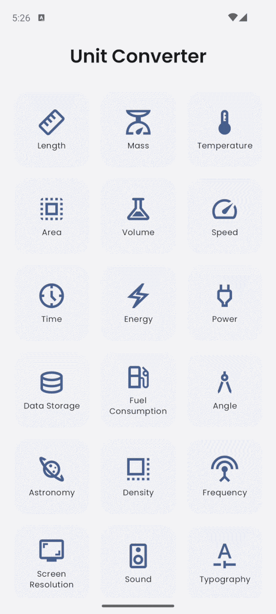
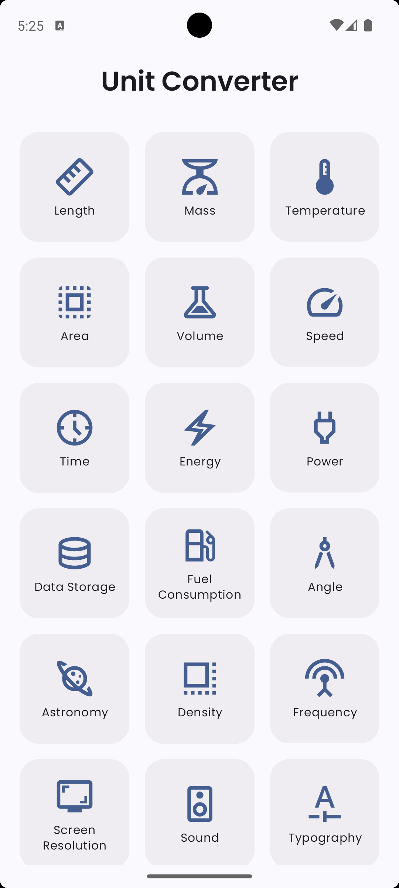
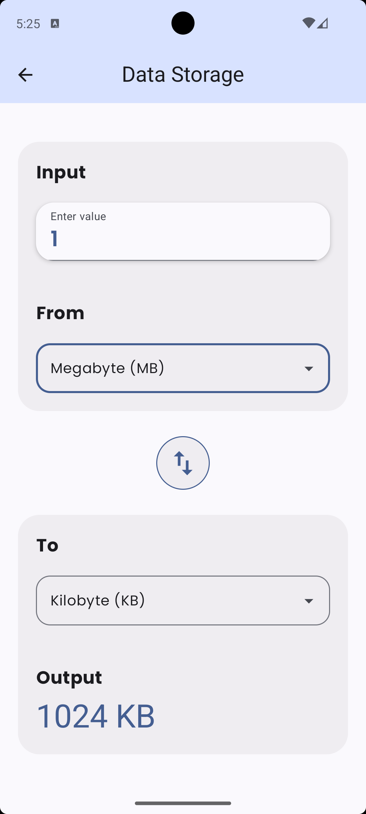
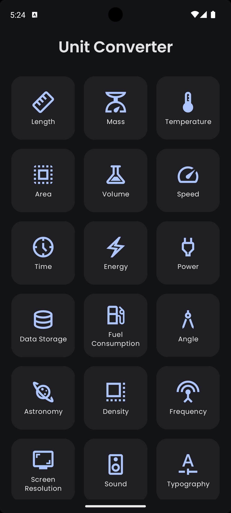
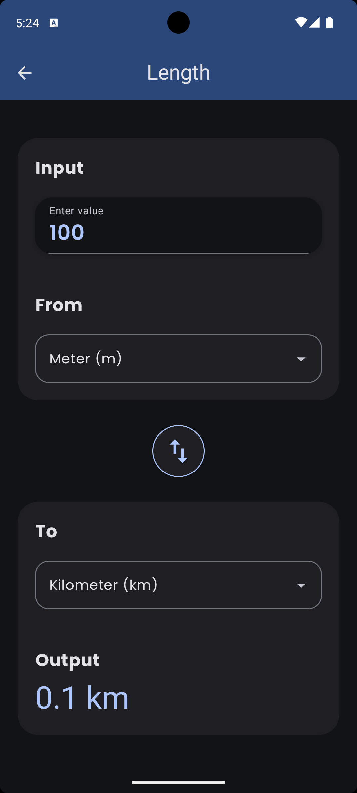

# Unit Converter

A clean, modern Android unit converter app built with **Jetpack Compose** and **Material 3**. Supports 18 conversion categories with an intuitive two-screen flow.

<p align="center">
  
</p>

---

## Screenshots

<p align="center">
  <b>Light Theme</b>
</p>
<p align="center">
  
  &nbsp;&nbsp;
  
</p>

<p align="center">
  <b>Dark Theme</b>
</p>
<p align="center">
  
  &nbsp;&nbsp;
  
</p>

---

## Features

- **18 conversion categories**

  | Category | Example units |
  |---|---|
  | Length | m, km, cm, mm, in, ft, mi |
  | Mass | g, kg, mg, t, lb, oz |
  | Temperature | °C, °F, K |
  | Area | m², km², cm², ha, ac |
  | Volume | L, mL, m³, gal, cup |
  | Speed | m/s, km/h, mph, kn |
  | Time | s, min, h, d |
  | Energy | J, kJ, cal, kWh |
  | Power | W, kW, hp |
  | Data Storage | B, KB, MB, GB |
  | Fuel Consumption | L/100km, km/L, mpg |
  | Angle | °, rad |
  | Astronomy | AU, ly, pc, km |
  | Density | kg/m³, g/cm³, g/L, lb/ft³ |
  | Frequency | Hz, kHz, MHz, GHz |
  | Screen Resolution | px, pt, dp, sp |
  | Sound | dB, B |
  | Typography | px, pt, em, rem, sp |

- Live conversion as you type
- Swap "from" and "to" units with one tap
- Dropdown unit selectors
- Input validation with error feedback
- Light & Dark theme support (Material You)

---

## Tech Stack

| Layer | Technology |
|---|---|
| Language | Kotlin |
| UI | Jetpack Compose + Material 3 |
| Architecture | MVVM |
| State | `ViewModel` + `StateFlow` |
| Navigation | Navigation Compose |
| Testing | JUnit 4 (98 unit tests) |
| Min SDK | 24 (Android 7.0) |
| Target SDK | 36 |

---

## Project Structure

```
app/src/main/java/com/example/unitconverrter/
├── data/
│   ├── ConverterCategory.kt   # Category data model
│   ├── ConverterData.kt       # All 18 categories & their units
│   ├── ConverterType.kt       # Enum for conversion types
│   └── UnitItem.kt            # Single unit data model
├── engine/
│   └── ConversionEngine.kt    # Pure conversion logic
├── navigation/
│   └── UnitConverterApp.kt    # NavHost setup
├── screens/
│   ├── HomeScreen.kt          # Category grid
│   └── ConverterScreen.kt     # Conversion UI
├── viewmodel/
│   ├── ConverterViewModel.kt  # Business logic & state
│   └── ConverterUiState.kt    # UI state data class
└── ui/theme/                  # Colors, Typography, Theme
```

---

## Getting Started

1. Clone the repository:
   ```bash
   git clone https://github.com/petrakip/UnitConverter.git
   ```
2. Open the project in **Android Studio Hedgehog or newer**.
3. Let Gradle sync finish.
4. Run on an emulator or physical device (API 24+).

---

## Running Tests

```bash
./gradlew testDebugUnitTest
```

The test suite covers:
- All conversion functions in `ConversionEngine` (63 tests)
- All `ConverterViewModel` state transitions (34 tests)

---

## License

```
MIT License — feel free to use, modify, and distribute.
```
